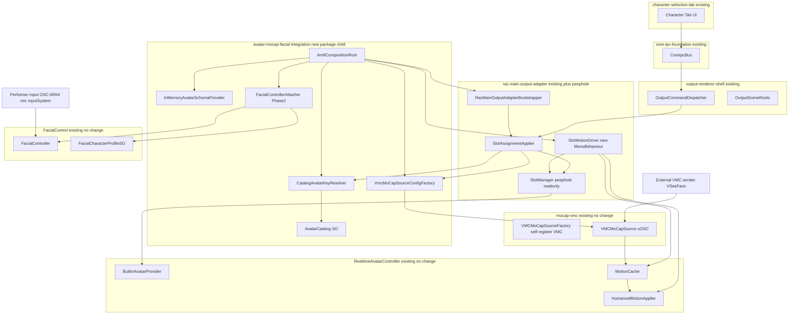
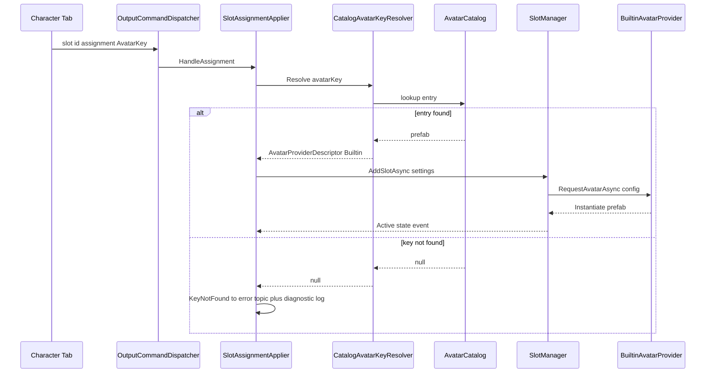
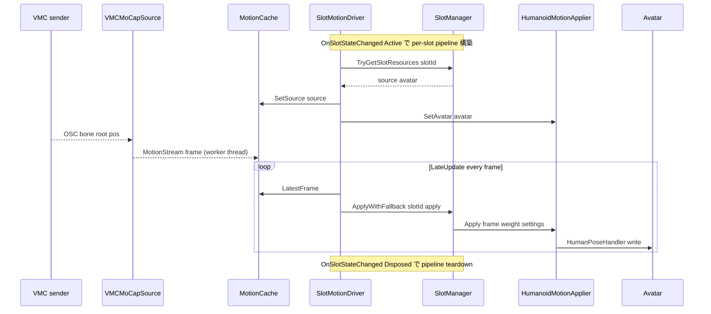
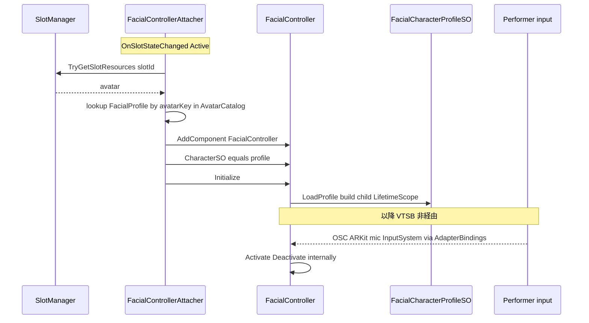

# 技術設計書: avatar-mocap-facial-integration

## Overview

本機能は、VTuberSystemBase(VTSB) に実アバターをランタイム表示し、VMC モーキャップで全身を駆動し、FacialControl フレームワークで表情を制御する統合レイヤーを追加する。既存の Character タブ / IPC / Spout 出力経路を流用しつつ、Addressables に依存せず RAC(`com.hidano.realtimeavatarcontroller` 0.2.0) の `BuiltinAvatarProvider` で FBX prefab を直接 Instantiate する。

**Purpose**: VTSB 運用者が、配信基盤(Addressables)を構成せずに FBX アバターをスロットへ割り当て、VMC 送信元から全身モーションを受け、FacialControl の自前入力バインディング(OSC/ARKit・uLipSync・InputSystem)で表情を演者自走させ、配信出力(Spout/URP/RT)に乗せられる状態を提供する。

**Users**: VTSB の開発者(統合配線の実装・保守)と運用者(Play モードで FBX 割当→VMC で全身駆動→演者入力で表情を OBS/Game ビューで目視確認)。

**Impact**: 既存システムを無改修のまま拡張する方針(Option C: 子供＋覗き窓)を採る。自前実装一式は新規統合パッケージに集約し、既存 `rac-main-output-adapter` には「SlotManager の read-only 公開」と「モーション駆動 MonoBehaviour(SlotMotionDriver)」のみを最小追加する。RAC 本体・他既存 spec パッケージは無改修。

### Goals

- Addressables 非依存で FBX prefab アバターをスロットへ割当・表示する(`IAvatarKeyResolver`/`IAvatarSchemaProvider` の `OverrideServices` 差し替え)。
- VMC モーキャップを mocap source として配線し(typeId="VMC")、RAC SlotManager が適用しない全身モーションフレームを VTSB 側の毎フレーム適用ループ(SlotMotionDriver)で補う。
- FacialControl の `FacialController` を slot Active 後の avatar へ実行時 Add し、`FacialCharacterProfileSO` を割当・`Initialize()` する(以降の表情駆動は FacialControl の自前バインディングが自走)。
- 段階導入: Phase 1(avatar+VMC+モーション、facial 参照なしで成立) → Phase 2(facial 結線)を asmdef 分離で物理的に切り離す。
- 既存無改修原則と「子供＋覗き窓」境界を維持し、Unity 6000.3.10f1 / URP 17.3.0 で目視検証シナリオを成立させる。

### Non-Goals

- RAC 本体(`com.hidano.realtimeavatarcontroller`)の改修。RAC の `IFacialController`/`facialControllerDescriptor`(0.2.0 未消費)の利用。
- 表情の IPC(Character タブ)経由駆動。表情スキーマ・settings/command ルーティング・表情用 `IAvatarSettingsAdapter`。これらは演者自走化により本仕様スコープ外(将来 Phase3 で任意追加)。
- VContainer LifetimeScope の VTSB 側明示構築(FacialController が per-controller child scope を内製)。
- VRM アバター対応(FacialControl が現状 FBX 前提)、Addressables を用いたアバター配信、Spout/URP/RT 出力・Character タブ UI・IPC 基盤・core-ipc-foundation の新規実装(すべて既存流用)。

## Boundary Commitments

### This Spec Owns

- 新規統合パッケージ(`com.hidano.vtuber-system-base.avatar-mocap-facial-integration`、以下 AMFI)に集約する自前実装:
  - `CatalogAvatarKeyResolver`(`IAvatarKeyResolver`、SerializeField カタログ駆動・Addressables 非依存)。
  - `InMemoryAvatarSchemaProvider`(`IAvatarSchemaProvider`、インメモリ・非表情設定中心)。
  - `VmcMoCapSourceConfigFactory`(`IMoCapSourceConfigFactory`、typeId="VMC" descriptor)。
  - `AvatarCatalog`(ScriptableObject、avatarKey→(Prefab, FacialCharacterProfileSO) を一元管理)。
  - `AmfiCompositionRoot`(統合 Composition Root MonoBehaviour、Bootstrapper を生成・OverrideServices・Initialize)。
  - `FacialControllerAttacher`(Phase 2、slot Active 後に avatar へ FacialController を実行時 Add・Profile 割当・Initialize)。
- 既存 `rac-main-output-adapter` への最小追加(覗き窓):
  - `RacMainOutputAdapterBootstrapper.SlotManager` / `OnSlotStateChanged` の read-only 公開プロパティ。
  - `SlotMotionDriver`(MonoBehaviour、Active スロット毎に `TryGetSlotResources`→`MotionCache`→`HumanoidMotionApplier` を `LateUpdate` 駆動)。
- パッケージ取込配線: `manifest.json` への git+ssh 5 件・OpenUPM scope・VContainer 明示 dependency と AMFI asmdef 参照。

### Out of Boundary

- RAC SlotManager の内部実装(slot ライフサイクル・provider/source 解決・参照カウント)。AMFI は公開 API(`AddSlotAsync`/`TryGetSlotResources`/`ApplyWithFallback`/`GetSlot`/`OnSlotStateChanged`)のみ利用。
- FacialControl 内部(PlayableGraph 構築・child LifetimeScope・OSC/InputSystem/LipSync の入力受信)。AMFI は `AddComponent`+`CharacterSO`設定+`Initialize()` までで、表情駆動には一切関与しない。
- IPC トランスポート/ルーティング(core-ipc-foundation)、Character タブ UI、Spout/URP/RT 出力経路、`SlotAssignmentApplier`/`SlotSettingsApplier` 等の既存受信層ロジック。
- 表情の IPC ルーティング(旧 Requirement 6、スコープ外)。

### Allowed Dependencies

- RAC: `RealtimeAvatarController.Core`(`SlotManager`/`AvatarProviderDescriptor`/`MoCapSourceDescriptor`/`RegistryLocator`)、`RealtimeAvatarController.Avatar.Builtin`(`BuiltinAvatarProviderConfig`/`BuiltinAvatarProviderFactory`)、`RealtimeAvatarController.Motion`(`MotionCache`/`HumanoidMotionApplier`)、`RealtimeAvatarController.MoCap.VMC`(`VMCMoCapSourceConfig`/`VMCMoCapSourceFactory`)。
- VTSB: `VTuberSystemBase.RacMainOutputAdapter`(拡張点 + 覗き窓 API)、`VTuberSystemBase.CharacterSelectionTab.Contracts`(`AvatarCatalogEntry`/`AvatarSettingsSchemaPayload`)、`VTuberSystemBase.IntegratedDemo`(統合点)。
- FacialControl(Phase 2 のみ): `Hidano.FacialControl.Adapters`(`FacialController`/`FacialCharacterProfileSO`)。
- 依存方向制約: AMFI → (rac-main-output-adapter, RAC, FacialControl)。逆方向参照(既存→AMFI)は禁止。Phase 1 asmdef は FacialControl を参照しない。

### Revalidation Triggers

- RAC `SlotManager` の公開 API シグネチャ変更(`TryGetSlotResources`/`ApplyWithFallback`/`OnSlotStateChanged`/`GetSlot`)。
- RAC `BuiltinAvatarProviderConfig`/`AvatarProviderDescriptor`、`VMCMoCapSourceConfig`/typeId="VMC" の自己登録仕様変更。
- `IAvatarKeyResolver`/`IAvatarSchemaProvider`/`IMoCapSourceConfigFactory` 拡張点シグネチャ、`RacMainOutputAdapterBootstrapper.OverrideServices`/`Initialize` の契約変更。
- FacialControl `FacialController` の `CharacterSO`/`Initialize()`/`Activate`/`Deactivate` 契約、`FacialCharacterProfileSO`(名前空間 `Hidano.FacialControl.Adapters.ScriptableObject.Serializable`)変更。
- 再生サイクル(DisableDomainReload)での登録/破棄前提の変更(MEMORY: ui_shell_addressables_nonfatal と整合必須)。

## Architecture

### Existing Architecture Analysis

`rac-main-output-adapter` は完成済みで、4 つの拡張点(`IAvatarKeyResolver`/`IAvatarSchemaProvider`/`IMoCapSourceConfigFactory`/`IAvatarSettingsAdapter`)と `RacMainOutputAdapterBootstrapper.OverrideServices(...)` により、RAC 本体・既存パッケージ無改修で差し替え可能な設計を持つ。`Initialize()` は null 合体(`??=`)で既定実装(`AddressablesAvatarKeyResolver` 等)へフォールバックするため、`OverrideServices` を `Initialize()` 前に呼べば自前実装が採用される。

ただし `OverrideServices` を呼ぶ唯一の本番経路 `RacMainOutputAdapterHost.Start()` は `dispatcher/sceneRoots/messageSink/logger` のみを渡し、`keyResolver/schemaProvider/mocapFactory` を渡していない。`IntegratedDemoBootstrap` は `RacMainOutputAdapterHost` を inactive child GameObject に生成して reflection で bus/scene を結線するだけである。したがって自前解決を差し込むには、Host を改修せず本仕様用の薄い Composition Root を新設して `RacMainOutputAdapterBootstrapper` を直接生成し、自前 3 実装を `OverrideServices` するアプローチを採る。

最大のギャップは全身モーション適用。RAC `SlotManager.AddSlotAsync` は provider/source を Resolve+Initialize するのみで `IMoCapSource`→avatar 適用を行わない(`TryGetSlotResources` で上位委譲を明記)。RAC Sample の `SlotManagerBehaviour`(`Samples~/UI/Runtime/SlotManagerBehaviour.cs`)が完全な雛形であり、`OnSlotStateChanged(Active)` で `MotionCache.SetSource`+`HumanoidMotionApplier.SetAvatar` を per-slot 構築、`LateUpdate` で `SlotManager.ApplyWithFallback` を回す。ただし adapter は専用 `SlotManager` を `RacMainOutputAdapterBootstrapper._slotManager`(private)に保持するため、同一 SlotManager を駆動ループと共有するには Bootstrapper への read-only 公開が必須となる。

### Architecture Pattern & Boundary Map

採用パターン: **Option C(子供＋覗き窓)**。自前実装は新規 AMFI パッケージに集約(子供=4 既存パッケージに依存)、既存 adapter には SlotManager 参照公開と駆動 MonoBehaviour のみを最小追加(覗き窓)。



**Key Decisions**:

- **Composition Root による注入**: Host(別 spec 所有)を改修せず、AMFI が `RacMainOutputAdapterBootstrapper` を直接生成し `OverrideServices(keyResolver, schemaProvider, mocapFactory, ...)`+`Initialize()` する。IntegratedDemo は RAC 生成箇所を AMFI Composition Root に差し替える(後述 §System Flows / §Components)。
- **SlotManager 共有**: 駆動ループ(SlotMotionDriver)は Composition Root が `OverrideServices` した同一 SlotManager を Bootstrapper の read-only 公開経由で取得する。別 `new SlotManager(...)` を作ると slot が存在せず適用不可。
- **演者自走表情**: FacialControl は RAC と独立駆動。AMFI は結線(Add/Profile/Initialize)のみで Activate/Deactivate は呼ばない。表情入力(OSC/ARKit・uLipSync・InputSystem)は `FacialCharacterProfileSO.AdapterBindings` 経由で FacialController 内部の child LifetimeScope が自走する。
- **Phase 分離**: SlotMotionDriver と自前 3 実装・Catalog は FacialControl 非依存(Phase 1 asmdef)。FacialControllerAttacher のみ別 asmdef(Phase 2)に隔離し、Phase 1 は facial パッケージ参照なしでコンパイル/再生できる。

### Technology Stack

| Layer | Choice / Version | Role in Feature | Notes |
|-------|------------------|-----------------|-------|
| アバター生成 | RealtimeAvatarController 0.2.0 (`BuiltinAvatarProvider`) | FBX prefab 直 Instantiate | Addressables 非依存。`BuiltinAvatarProviderConfig.avatarPrefab` を AMFI resolver が動的生成 |
| モーキャップ | mocap-vmc 0.1.0 (typeId="VMC") | uOSC で `/VMC/Ext/Bone/Pos`・`/VMC/Ext/Root/Pos` 受信 → `HumanoidMotionFrame` 発行 | `[RuntimeInitializeOnLoadMethod(BeforeSceneLoad)]` で自己登録。uOSC は VTSB 導入済 |
| モーション適用 | RAC `MotionCache`/`HumanoidMotionApplier` | 受信スレッド→メインスレッド受け渡し + `HumanPoseHandler` 適用 | `LateUpdate` 駆動必須。`Animator.isHuman` 必須 |
| 表情(Phase 2) | FacialControl 0.1.0-preview.2 + .lipsync/.osc/.inputsystem | `FacialController`(PlayableGraph) を avatar へ Add、`FacialCharacterProfileSO` 割当 | VContainer per-controller child scope 内製。演者自走 |
| DI(間接) | VContainer 1.16.6 (jp.hadashikick) | FacialControl 内部依存解決 | manifest 明示 dependency + OpenUPM scope。VTSB 側で LifetimeScope を張らない |
| 出力 | URP 17.3.0 / Spout / RT (既存) | アバター描画→OBS/Game ビュー | 無改修流用 |

新規依存(現行 manifest からの差分): mocap-vmc(git+ssh)、FacialControl 4 パッケージ(git+ssh)、VContainer(OpenUPM)。詳細は §File Structure Plan の manifest.json 追記を参照。

## File Structure Plan

### Directory Structure

新規パッケージ `VTuberSystemBase/Packages/com.hidano.vtuber-system-base.avatar-mocap-facial-integration/`:

```
com.hidano.vtuber-system-base.avatar-mocap-facial-integration/
├── package.json                       # 依存: rac-main-output-adapter, RAC, mocap-vmc(間接)
├── Runtime/
│   ├── VTuberSystemBase.AvatarMocapFacialIntegration.Runtime.asmdef   # Phase1: facial 非参照
│   ├── Catalog/
│   │   ├── AvatarCatalog.cs           # SO: avatarKey→(Prefab, FacialProfile, DisplayName)
│   │   └── AvatarCatalogEntryAsset.cs # 1 エントリの Serializable 型(SO 内 list)
│   ├── Resolution/
│   │   ├── CatalogAvatarKeyResolver.cs    # IAvatarKeyResolver(Addressables 非依存)
│   │   └── InMemoryAvatarSchemaProvider.cs # IAvatarSchemaProvider(非表情設定)
│   ├── Mocap/
│   │   └── VmcMoCapSourceConfigFactory.cs  # IMoCapSourceConfigFactory(typeId=VMC)
│   ├── Diagnostics/
│   │   └── MoCapRegistryProbe.cs      # 任意: 登録済み typeId 一覧をログ出力(R3.2 検証)
│   └── Composition/
│       └── AmfiCompositionRoot.cs     # 統合 Composition Root(MonoBehaviour)
├── Facial/                            # Phase2: 別 asmdef で facial 隔離
│   ├── VTuberSystemBase.AvatarMocapFacialIntegration.Facial.asmdef   # Hidano.FacialControl.Adapters 参照
│   └── FacialControllerAttacher.cs    # slot Active 後に FacialController を実行時 Add
├── Editor/
│   ├── VTuberSystemBase.AvatarMocapFacialIntegration.Editor.asmdef
│   └── AvatarCatalogEditor.cs         # 任意: カタログ編集補助
└── Tests/
    ├── EditMode/  ...Tests.EditMode.asmdef   # resolver/factory/catalog
    └── PlayMode/  ...Tests.PlayMode.asmdef   # SlotMotionDriver / Attacher 結線
```

> `Facial/` は Phase 2 専用。Phase 1 では `Runtime/` のみで avatar+VMC+motion が成立し、`Facial.asmdef` は `Runtime.asmdef`(+ FacialControl)に依存する子 asmdef とする。Phase 1 を facial パッケージ未導入でコンパイルするには、`Facial.asmdef` に `defineConstraints: ["AMFI_FACIAL"]` を設定し、facial 導入時に Scripting Define を立てる方式を採る(代替: Phase 1 では `Facial/` ディレクトリ自体を未配置とし Phase 2 で追加)。本設計は **defineConstraints 方式**を採用し、Phase 1 でディレクトリは存在するが未コンパイルとする。

### Modified Files

- `VTuberSystemBase/Packages/com.hidano.vtuber-system-base.rac-main-output-adapter/Runtime/Bootstrapper/RacMainOutputAdapterBootstrapper.cs`
  — read-only 公開プロパティ `public SlotManager SlotManager => _slotManager;` **のみ**を追加(覗き窓。既存ロジック不変)。状態ストリームは `SlotManager.OnSlotStateChanged`(SlotManager が既に `IObservable<SlotStateChangedEvent>` で公開済み)を購読者が直接使う。
  — ⚠️ **第 2 プロパティを `OnSlotStateChanged` 名で足してはならない**: 当該クラスには既に private ハンドラメソッド `void OnSlotStateChanged(string, SlotState, SlotState, string)`(`:247`)が存在し、同名プロパティは CS0102(duplicate member name)でコンパイル不能。`SlotManager` 公開 1 本に集約して回避する(R4.1 充足には `SlotManager` 公開で十分)。
- `VTuberSystemBase/Packages/com.hidano.vtuber-system-base.rac-main-output-adapter/Runtime/Drivers/SlotMotionDriver.cs`(新規ファイル、既存 asmdef 内)
  — `LateUpdate` 駆動 MonoBehaviour。RAC `Motion` asmdef 参照を `VTuberSystemBase.RacMainOutputAdapter.Runtime.asmdef` の `references` に追加(`RealtimeAvatarController.Motion`)。
- `VTuberSystemBase/Packages/com.hidano.vtuber-system-base.integrated-demo/Runtime/IntegratedDemoBootstrap.cs`
  — `EnsureRacAdapterAfterBusReady()` の代わりに(または条件分岐で) AMFI `AmfiCompositionRoot` を生成・起動する統合点を追加。AMFI 未配置時は従来の `RacMainOutputAdapterHost` 経路を維持(段階導入の安全弁)。
- `VTuberSystemBase/Packages/manifest.json`
  — dependencies / scopedRegistries 追記(下記)。

**manifest.json 追記内容**:

```jsonc
// dependencies に追加(git+ssh 5 件 + VContainer 1 件)
"com.hidano.realtimeavatarcontroller.mocap-vmc":
  "git@github.com:Hidano-Dev/RealtimeAvatarController.git?path=RealtimeAvatarController/Packages/com.hidano.realtimeavatarcontroller.mocap-vmc#main",
"com.hidano.facialcontrol":
  "git@github.com:NHidano/FacialControl.git?path=FacialControl/Packages/com.hidano.facialcontrol#feature/hidano/generate-prototype",
"com.hidano.facialcontrol.lipsync":
  "git@github.com:NHidano/FacialControl.git?path=FacialControl/Packages/com.hidano.facialcontrol.lipsync#feature/hidano/generate-prototype",
"com.hidano.facialcontrol.osc":
  "git@github.com:NHidano/FacialControl.git?path=FacialControl/Packages/com.hidano.facialcontrol.osc#feature/hidano/generate-prototype",
"com.hidano.facialcontrol.inputsystem":
  "git@github.com:NHidano/FacialControl.git?path=FacialControl/Packages/com.hidano.facialcontrol.inputsystem#feature/hidano/generate-prototype",
"jp.hadashikick.vcontainer": "1.16.6"

// scopedRegistries の OpenUPM entry の scopes に "jp.hadashikick" を 1 行追加
```

> VContainer は FacialControl asmdef が `VContainer` を参照するだけで package.json dependency には無いため、`manifest.json` dependencies への明示追記が必要(scope 追加だけでは解決されない)。FacialControl コアは `com.hidano.scene-view-style-camera-controller 1.0.0` 依存だが VTSB は 1.0.1 で充足。AMFI パッケージ自体は npm scope(`com.hidano`)で解決されるローカル embedded パッケージとして配置する。

## System Flows

### Flow 1: アバター割当(Character タブ → 表示)



割当後の `OnSlotStateChanged(Active)` が、SlotMotionDriver(Flow 2)と FacialControllerAttacher(Flow 3 Phase 2)の per-slot 構築トリガとなる。

### Flow 2: 全身モーション適用(SlotMotionDriver)



VMC 無送信時は `MotionCache.LatestFrame` が前フレームを保持し、`SlotSettings.fallbackBehavior=HoldLastPose`(既定)で直前姿勢を維持する(R3.4)。非 Humanoid avatar は `SetAvatar` が `InvalidOperationException` を投げるため、Driver は該当 slot の pipeline を構築せずスキップする(R4.4)。

### Flow 3: 表情駆動(演者自走、Phase 2、VTSB 非経由)



VTSB は `Initialize()` まで。`Activate`/`Deactivate` は FacialControl の入力バインディングが自走発火する。slot Disposed 時は avatar GameObject ごと破棄され、`FacialController.OnDisable`→`Cleanup` で child scope が dispose される(整合的)。

## Requirements Traceability

| Requirement | Summary | Components | Flows |
|-------------|---------|------------|-------|
| 1.1–1.5 | パッケージ取込・依存解決 | manifest.json 追記、AMFI package.json/asmdef | — |
| 2.1, 2.6 | 自前 resolver / Addressables 非依存 | CatalogAvatarKeyResolver, AvatarCatalog | Flow 1 |
| 2.2 | インメモリ schema provider | InMemoryAvatarSchemaProvider | — |
| 2.3 | OverrideServices 差し替え | AmfiCompositionRoot | Flow 1 |
| 2.4 | FBX prefab Instantiate | CatalogAvatarKeyResolver → BuiltinAvatarProvider | Flow 1 |
| 2.5 | 未解決時の診断ログ | CatalogAvatarKeyResolver | Flow 1 |
| 3.1, 3.2 | VMC descriptor factory / 自己登録確認 | VmcMoCapSourceConfigFactory, MoCapRegistryProbe | — |
| 3.3 | uOSC 受信→HumanoidMotionFrame | VMCMoCapSource(既存) | Flow 2 |
| 3.4 | 無送信時 HoldLastPose | SlotMotionDriver, MotionCache(既存) | Flow 2 |
| 4.1, 4.2 | Active 毎フレーム適用ループ | SlotMotionDriver | Flow 2 |
| 4.3 | 全身追従(目視) | SlotMotionDriver → HumanoidMotionApplier | Flow 2 |
| 4.4 | source 未解決 slot スキップ | SlotMotionDriver | Flow 2 |
| 4.5 | 非 Active で適用停止 | SlotMotionDriver(teardown) | Flow 2 |
| 5.1 | FacialController 結線 + Profile 割当 | FacialControllerAttacher | Flow 3 |
| 5.2, 5.3 | Activate/Deactivate(FacialControl 内部) | FacialController(既存、演者自走) | Flow 3 |
| 5.4 | RAC IFacialController 不使用 | FacialControllerAttacher(独立駆動) | Flow 3 |
| 5.5 | per-controller LifetimeScope | FacialController(内製、VTSB 非構築) | Flow 3 |
| 5.6 | BlendShape/Profile 欠如時の診断ログ | FacialControllerAttacher | Flow 3 |
| 7.1–7.3 | 段階導入(asmdef 分離) | Runtime.asmdef / Facial.asmdef(defineConstraints) | — |
| 8.1–8.5 | 出力結線・目視検証 | 既存 Spout/URP/RT 流用、AmfiCompositionRoot | Flow 1/2/3 |

> Requirement 6(表情 IPC ルーティング)は演者自走化によりスコープ外。本仕様では対応コンポーネントを実装しない。

## Components and Interfaces

| Component | Domain/Layer | Intent | Req Coverage | Key Dependencies (P0/P1) | Contracts |
|-----------|--------------|--------|--------------|--------------------------|-----------|
| AvatarCatalog | AMFI Data(SO) | avatarKey→(Prefab, FacialProfile, DisplayName) 一元管理 | 2.1, 2.4, 5.1 | — | State |
| CatalogAvatarKeyResolver | AMFI Resolution | カタログ駆動 `IAvatarKeyResolver`(Addressables 非依存) | 2.1, 2.4–2.6 | AvatarCatalog (P0), RAC Builtin (P0) | Service |
| InMemoryAvatarSchemaProvider | AMFI Resolution | 非表情設定スキーマをインメモリ提供 | 2.2 | AvatarCatalog (P1) | Service |
| VmcMoCapSourceConfigFactory | AMFI Mocap | typeId="VMC" descriptor を構築 | 3.1 | RAC.MoCap.VMC (P0) | Service |
| MoCapRegistryProbe | AMFI Diagnostics | 登録済み typeId 一覧をログ出力(検証補助) | 3.2 | RegistryLocator (P2) | Service |
| AmfiCompositionRoot | AMFI Composition | Bootstrapper 生成・OverrideServices・Initialize・Driver/Attacher 配線 | 2.3, 7.1, 8.x | Bootstrapper (P0), SlotMotionDriver (P0) | Service |
| SlotMotionDriver | Adapter Driver(peephole) | Active 毎フレーム `LateUpdate` 適用ループ | 4.1–4.5, 3.4 | SlotManager (P0), MotionCache/Applier (P0) | Service, State |
| RacMainOutputAdapterBootstrapper(改修) | Adapter Bootstrap(peephole) | SlotManager/OnSlotStateChanged read-only 公開 | 4.1 | SlotManager (P0) | State |
| FacialControllerAttacher | AMFI Facial(Phase 2) | avatar へ FacialController 実行時 Add + Profile + Initialize | 5.1, 5.4–5.6 | FacialControl Adapters (P0), AvatarCatalog (P0) | Service |

### AMFI Data Layer

#### AvatarCatalog

| Field | Detail |
|-------|--------|
| Intent | avatarKey から FBX prefab・FacialCharacterProfileSO(任意)・表示名を引く ScriptableObject カタログ |
| Requirements | 2.1, 2.4, 5.1 |

**Responsibilities & Constraints**

- `[CreateAssetMenu]` で生成する SO。`List<AvatarCatalogEntryAsset>` を SerializeField で保持し、avatarKey をキーとした一意性を `OnValidate` で検証。
- 各エントリ: `string AvatarKey`(一級識別子)、`string DisplayName`、`GameObject AvatarPrefab`(Humanoid rig + BlendShape 付き FBX)、`FacialCharacterProfileSO FacialProfile`(任意、Phase 2 専用・型参照は Facial asmdef 側で扱う)。
- データ所有: アバター一覧の唯一の真実。resolver / schema provider / attacher が読み取り専用参照する。
- 制約: Phase 1 asmdef は FacialControl 型を参照できないため、`FacialProfile` 参照は `UnityEngine.Object`(or `[SerializeReference]`)で保持し Facial asmdef 側でキャストする、または Catalog を Phase1 コア部と Phase2 facial 拡張に分離する。本設計は **`FacialProfile` を `UnityEngine.Object` 型 SerializeField で保持し、`FacialControllerAttacher` が `as FacialCharacterProfileSO` で解決**する方式を採る(Phase 1 の facial 非依存を維持)。

**Contracts**: State [x]

**Implementation Notes**

- Integration: prefab は通常 Assets 配下(Addressables 不要)に置き、SO が参照を握る。検証用 FBX は Humanoid rig(`Animator.isHuman==true`)かつ BlendShape 付き SkinnedMeshRenderer。
- Validation: avatarKey 重複・prefab null を `OnValidate` で警告。
- Risks: FacialProfile を弱型(`UnityEngine.Object`)で持つため誤アセット割当を実行時まで検出できない → Attacher 側で型チェック + 診断ログ。

### AMFI Resolution Layer

#### CatalogAvatarKeyResolver

| Field | Detail |
|-------|--------|
| Intent | `AvatarCatalog` から prefab を引き `BuiltinAvatarProviderConfig` を動的生成して `AvatarProviderDescriptor` を返す `IAvatarKeyResolver` |
| Requirements | 2.1, 2.4, 2.5, 2.6 |

**Responsibilities & Constraints**

- `IAvatarKeyResolver` を実装(`AddressablesAvatarKeyResolver` と同型だが Addressables を一切参照しない)。
- `Resolve(avatarKey)`: カタログ命中時 `ScriptableObject.CreateInstance<BuiltinAvatarProviderConfig>()` に `avatarPrefab=entry.AvatarPrefab` を設定し、`ProviderTypeId=BuiltinAvatarProviderFactory.BuiltinProviderTypeId` の descriptor を返す。未命中は `null`(呼出側 `SlotAssignmentApplier` が `KeyNotFound` 翻訳)+ 診断ログ(R2.5)。
- `AvatarKeys`: カタログ全エントリを `AvatarCatalogEntry`(`AvatarKey`/`DisplayName`)で列挙 → `AvatarCatalogPublisher` 経由で Character タブのアバター一覧を埋める。
- `Refresh()`: カタログは静的のため即時完了(必要なら `OnAvatarKeysChanged` 発火)。

**Dependencies**

- Inbound: AmfiCompositionRoot — `OverrideServices` で注入 (P0)
- Outbound: AvatarCatalog — prefab/エントリ参照 (P0)
- External: RAC `BuiltinAvatarProviderConfig`/`BuiltinAvatarProviderFactory` — descriptor 生成 (P0)

**Contracts**: Service [x]

##### Service Interface
```csharp
public sealed class CatalogAvatarKeyResolver : IAvatarKeyResolver
{
    public CatalogAvatarKeyResolver(AvatarCatalog catalog, IDiagnosticsLogger logger);
    public AvatarProviderDescriptor Resolve(string avatarKey);          // 未命中は null
    public IReadOnlyList<AvatarCatalogEntry> AvatarKeys { get; }
    public UniTask Refresh();
    public event Action OnAvatarKeysChanged;
}
```
- Preconditions: `catalog != null`。`Resolve` は Unity メインスレッドから呼ばれる。
- Postconditions: 命中時 `Config.avatarPrefab != null` の descriptor。未命中時 `null` + 診断ログ。
- Invariants: Addressables 型を参照しない(R2.6)。

#### InMemoryAvatarSchemaProvider

| Field | Detail |
|-------|--------|
| Intent | `avatars/{key}/schema` 要求に非表情設定中心の `AvatarSettingsSchemaPayload` を同期返却 |
| Requirements | 2.2 |

**Responsibilities & Constraints**

- `IAvatarSchemaProvider.Resolve(avatarKey)` を同期実装(5 秒以内)。表情は演者自走化のためスキーマ対象外。当面は空スキーマ(または将来の非表情設定)を返す最小実装。未解決時 `null`(呼出側で空スキーマフォールバック)。

**Contracts**: Service [x]
```csharp
public sealed class InMemoryAvatarSchemaProvider : IAvatarSchemaProvider
{
    public AvatarSettingsSchemaPayload Resolve(string avatarKey);  // 当面は空スキーマ
}
```

### AMFI Mocap Layer

#### VmcMoCapSourceConfigFactory

| Field | Detail |
|-------|--------|
| Intent | slot 単位で typeId="VMC" の `MoCapSourceDescriptor`(`VMCMoCapSourceConfig` を含む)を構築 |
| Requirements | 3.1 |

**Responsibilities & Constraints**

- `IMoCapSourceConfigFactory.Build(slotId)` を実装。`ScriptableObject.CreateInstance<VMCMoCapSourceConfig>()`(port=39539, bindAddress="0.0.0.0")を `Config` とし `SourceTypeId="VMC"`(=`VMCMoCapSourceFactory.VmcSourceTypeId`)の descriptor を返す。
- typeId="VMC" の Factory 自己登録(`[RuntimeInitializeOnLoadMethod(BeforeSceneLoad)]`)は mocap-vmc パッケージ側が担うため AMFI は登録しない。`SlotManager.AddSlotAsync` 内 `_moCapSourceRegistry.Resolve(descriptor)` 成否で解決確認。

**Contracts**: Service [x]
```csharp
public sealed class VmcMoCapSourceConfigFactory : IMoCapSourceConfigFactory
{
    public MoCapSourceDescriptor Build(string slotId);  // SourceTypeId = "VMC"
}
```

#### MoCapRegistryProbe(任意)

- `RegistryLocator.MoCapSourceRegistry` の登録済み typeId 一覧をログ出力する診断ユーティリティ(R3.2 の自己登録検証手段)。本体機能には必須でないため、Editor 専用 or 起動時 1 回のログ出力に留める。**未決論点**: 実装要否は実機検証時に「Resolve 成否で十分」なら省略可。

### AMFI Composition Layer

#### AmfiCompositionRoot

| Field | Detail |
|-------|--------|
| Intent | `RacMainOutputAdapterBootstrapper` を直接生成・自前 3 実装を `OverrideServices`・`Initialize` し、SlotMotionDriver / FacialControllerAttacher を slot ライフサイクルへ接続する統合 Composition Root |
| Requirements | 2.3, 7.1, 8.x |

**Responsibilities & Constraints**

- MonoBehaviour。SerializeField: `AvatarCatalog _catalog`、`bool _enableFacial`(Phase 2 切替)。`OutputSceneBootstrapper`/`ICoreIpcBusProvider` 参照は IntegratedDemo から注入(Host と同じ dispatcher/sceneRoots/messageSink を解決)。
- 起動順序: dispatcher/bus が available になった後(IntegratedDemo の `StartAdaptersAfterOutputReady` 相当タイミング)に:
  1. `new RacMainOutputAdapterBootstrapper()` を生成。
  2. `OverrideServices(dispatcher, sceneRoots, messageSink, keyResolver: new CatalogAvatarKeyResolver(...), schemaProvider: new InMemoryAvatarSchemaProvider(...), mocapFactory: new VmcMoCapSourceConfigFactory(), logger)` を呼ぶ。
  3. `Initialize()`。
  4. Bootstrapper の read-only 公開 `SlotManager`/`OnSlotStateChanged` を取得し、`SlotMotionDriver.Attach(slotManager)` を呼んで購読開始。
  5. `_enableFacial` 時のみ `FacialControllerAttacher.Attach(slotManager, catalog)`(Phase 2 asmdef)。
- ライフサイクル/再生サイクル堅牢化(MEMORY: ui_shell_addressables_nonfatal 整合): `OnDestroy`/`ExitingPlayMode` で `Bootstrapper.Shutdown()` + Driver/Attacher teardown を確実に行い、DisableDomainReload 下の static 残留・2 回目再生での二重登録を回避する。`CoreIpcRuntime.Current` の生死判定パターンに倣う。

**Dependencies**

- Inbound: IntegratedDemoBootstrap — 生成・起動・参照注入 (P0)
- Outbound: RacMainOutputAdapterBootstrapper — 生成/OverrideServices/Initialize (P0); SlotMotionDriver — 駆動配線 (P0); FacialControllerAttacher — 表情結線 (P1, Phase 2)
- External: OutputSceneBootstrapper / ICoreIpcBus — dispatcher/sink 解決 (P0)

**Contracts**: Service [x]

**Implementation Notes**

- Integration: IntegratedDemo は既存 `EnsureRacAdapterAfterBusReady()`(`RacMainOutputAdapterHost` 生成)を AMFI 起動に差し替える。AMFI 未導入時は従来経路で degrade(段階導入の安全弁)。
- Validation: `Initialize()` 二重呼び出し防止は Bootstrapper の `IsRunning` で担保済み。
- Risks: Host が別途同シーンに存在すると SlotManager が 2 つになり slot が二重生成 → IntegratedDemo 側で AMFI と Host のどちらか一方のみを起動する分岐を必須とする。

### Adapter Driver Layer(覗き窓: 既存パッケージへの最小追加)

#### SlotMotionDriver

| Field | Detail |
|-------|--------|
| Intent | Active スロット毎に `MotionCache`+`HumanoidMotionApplier` を構築し `LateUpdate` で `SlotManager.ApplyWithFallback` を駆動する MonoBehaviour |
| Requirements | 4.1–4.5, 3.4 |

**Responsibilities & Constraints**

- RAC Sample `SlotManagerBehaviour` を雛形とする(同一駆動構造)。ただし `SlotManager` は自前生成せず `Attach(SlotManager)` で外部注入された adapter の SlotManager を共有する(覗き窓経由)。
- `OnSlotStateChanged` を購読: `Active` で `TryGetSlotResources(slotId, out source, out avatar)` → `MotionCache.SetSource(source)`+`HumanoidMotionApplier.SetAvatar(avatar)` の per-slot pipeline を構築。`SetAvatar` が非 Humanoid で `InvalidOperationException` の場合は pipeline を作らずスキップ + 診断ログ(R4.4 / 非 Humanoid)。
- `LateUpdate`: 各 pipeline について `frame = cache.LatestFrame; weight = handle.Settings.weight;` を取り `SlotManager.ApplyWithFallback(slotId, () => applier.Apply(frame, weight, settings))`。`Disposed` で pipeline teardown(`Cache.Dispose`/`Applier.Dispose`)(R4.5)。
- スレッド: 全 RAC Motion API はメインスレッド `LateUpdate` 前提。
- フォールバック: VMC 無送信時は `LatestFrame` 前フレーム保持 + `HoldLastPose` で姿勢維持(R3.4)。

**Dependencies**

- Inbound: AmfiCompositionRoot — `Attach(slotManager)` (P0)
- Outbound: SlotManager — `TryGetSlotResources`/`ApplyWithFallback`/`GetSlot`/`OnSlotStateChanged` (P0)
- External: RAC `MotionCache`/`HumanoidMotionApplier` (P0)

**Contracts**: Service [x] / State [x]

##### Service Interface
```csharp
public sealed class SlotMotionDriver : MonoBehaviour
{
    public void Attach(SlotManager slotManager);   // 購読開始(Active/Disposed pipeline 構築/破棄)
    public void Detach();                          // 購読解除 + 全 pipeline teardown
    // private void LateUpdate(): 全 Active pipeline を ApplyWithFallback で駆動
}
```
- Preconditions: `Attach` は同一 SlotManager(adapter 保持インスタンス)を渡す。
- Postconditions: Active slot は毎フレーム最新 frame が avatar に適用される。
- Invariants: pipeline は slot ごとに高々 1 つ。非 Humanoid slot は pipeline 不在。

**Implementation Notes**

- Integration: 配置は `rac-main-output-adapter` パッケージ内(恒久的に綺麗・output-renderer-shell は slot を知らず不適)。`RealtimeAvatarController.Motion` asmdef 参照を Runtime asmdef に追加。
- Validation: `_pipelines.Count==0` の早期 return で no-op コスト最小化。
- Risks: SlotManager 共有を誤ると slot 不在で無動作 → AmfiCompositionRoot が Bootstrapper 公開プロパティから取得することを必須とする。

#### RacMainOutputAdapterBootstrapper(覗き窓プロパティ追加)

| Field | Detail |
|-------|--------|
| Intent | 駆動ループへ同一 SlotManager 参照を渡すための read-only 公開 |
| Requirements | 4.1 |

**Contracts**: State [x]
```csharp
// 既存クラスへ追加(ロジック不変・read-only)。SlotManager プロパティ 1 本のみ。
public SlotManager SlotManager => _slotManager;
// ※ OnSlotStateChanged プロパティは追加しない(既存 private メソッド :247 と CS0102 衝突)。
//   購読者は bootstrapper.SlotManager.OnSlotStateChanged(SlotManager 公開済み)を直接使う。
```
- Invariants: setter なし。`Initialize()` 後にのみ非 null。`Shutdown()` 後は null。
- 購読: SlotMotionDriver / FacialControllerAttacher は `Attach(slotManager)` で渡された `slotManager.OnSlotStateChanged`(`IObservable<SlotStateChangedEvent>`)を購読する。

### AMFI Facial Layer(Phase 2)

#### FacialControllerAttacher

| Field | Detail |
|-------|--------|
| Intent | slot Active 後に avatar へ `FacialController` を実行時 Add し `FacialCharacterProfileSO` を割当・`Initialize()`(以降は演者自走) |
| Requirements | 5.1, 5.4–5.6 |

**Responsibilities & Constraints**

- `OnSlotStateChanged(Active)` を購読: `TryGetSlotResources(slotId, out _, out avatar)` で avatar を取得し、avatarKey から `AvatarCatalog` の `FacialProfile`(弱型 → `as FacialCharacterProfileSO`)を解決。
- 結線: `avatar.GetComponent<FacialController>() ?? avatar.AddComponent<FacialController>()` → `fc.CharacterSO = profile` → `fc.Initialize()`。`FacialController` は `[RequireComponent(typeof(Animator))]` で avatar の Animator を要求(Humanoid 検証済 FBX なら充足)。
- 演者自走: `Activate`/`Deactivate` は呼ばない。入力(OSC/ARKit・uLipSync・InputSystem)は `FacialCharacterProfileSO.AdapterBindings` 経由で FacialController 内部の child LifetimeScope(VContainer)が自走(R5.5、VTSB 非構築)。RAC `IFacialController`/`facialControllerDescriptor` は不使用(R5.4)。
- 欠如時(R5.6): Profile 未割当 or avatar に BlendShape(SkinnedMeshRenderer)無しの場合は Add/Initialize をスキップし診断ログ。`Initialize()` 内部でも Animator/Renderer 不在時は warning ログで no-op。
- teardown: slot Disposed で avatar GameObject ごと破棄 → `FacialController.OnDisable`→`Cleanup` で child scope dispose(明示 teardown 不要だが Attacher の追跡辞書は掃除する)。

**Dependencies**

- Inbound: AmfiCompositionRoot — `Attach(slotManager, catalog)`(`_enableFacial` 時のみ) (P0)
- Outbound: SlotManager — `TryGetSlotResources`/`OnSlotStateChanged` (P0); AvatarCatalog — FacialProfile 解決 (P0)
- External: FacialControl `FacialController`/`FacialCharacterProfileSO`(namespace `Hidano.FacialControl.Adapters.Playable` / `...ScriptableObject.Serializable`) (P0)

**Contracts**: Service [x]
```csharp
public sealed class FacialControllerAttacher  // Facial.asmdef(defineConstraints AMFI_FACIAL)
{
    public void Attach(SlotManager slotManager, AvatarCatalog catalog);
    public void Detach();
}
```

**Implementation Notes**

- Integration: 別 asmdef(`...Facial`)に隔離し `Hidano.FacialControl.Adapters` を参照。Phase 1 は `defineConstraints: ["AMFI_FACIAL"]` で未コンパイル。
- Validation: avatarKey→avatar 対応は `SlotAssignmentApplier.OnAvatarKeyChanged` or slot handle から取得。`fc.Initialize()` は冪等でなく内部で毎回 `Cleanup()`→再構築する(`InitializeInternal`)ため、`fc.IsInitialized` を確認してから呼び二重 Init を回避する。
- 前提(明記): avatar GameObject は slot Disposed で破棄され、再 Active 時は `BuiltinAvatarProvider` が新規 Instantiate する(使い回さない)。これにより `AddComponent` 直後は `_characterSO==null` で `OnEnable` 自動 Init が no-op となり、Attacher の「Add → CharacterSO 代入 → Initialize()」順序が成立する。もし将来 avatar を再利用する設計に変える場合は、OnEnable 自動 Init と明示 Init の二重発火を再検討すること。
- Risks: FacialCharacterProfileSO の AdapterBindings(OSC ポート/ARKit/uLipSync デバイス)既定値は SO 設定に依存 → 検証用 SO の設定手順を README に記載(**未決論点**: 既定値確定)。

## Data Models

### Domain Model

- **AvatarCatalogEntry(VTSB Contracts、既存)**: `AvatarKey`(一級識別子)、`DisplayName`。`avatars/catalog` 列挙に使用。
- **AvatarCatalogEntryAsset(AMFI 新規・SO 内 Serializable)**: `AvatarKey`、`DisplayName`、`AvatarPrefab(GameObject)`、`FacialProfile(UnityEngine.Object 弱型 → FacialCharacterProfileSO)`。
- **AvatarProviderDescriptor(RAC、既存)**: `ProviderTypeId=Builtin`、`Config=BuiltinAvatarProviderConfig{ avatarPrefab }`。resolver が動的生成。
- **MoCapSourceDescriptor(RAC、既存)**: `SourceTypeId="VMC"`、`Config=VMCMoCapSourceConfig{ port=39539, bindAddress="0.0.0.0" }`。factory が動的生成。
- **不変条件**: AvatarKey はカタログ内一意。`AvatarPrefab` は Humanoid rig(`Animator.isHuman`)+ BlendShape 付き SkinnedMeshRenderer(検証前提)。

### Data Contracts & Integration

- 既存 IPC 契約(`slot/{id}/assignment`・`avatars/catalog`・`avatars/{key}/schema`・`slot/{id}/status`・`slot/{id}/error`)は無改修流用。AMFI は resolver/schema/factory を差し替えるのみで topic 形状は変えない。
- 表情は IPC 非経由(演者自走)のため新規 topic・payload を定義しない。

## Error Handling

### Error Strategy

| エラー | 検出箇所 | 戦略 |
|--------|----------|------|
| avatarKey 未解決(KeyNotFound) | CatalogAvatarKeyResolver.Resolve → null | 既存 `SlotAssignmentApplier` が `slot/{id}/error{KeyNotFound}` 翻訳 + AMFI が診断ログ(R2.5)。アバター生成せず継続 |
| VMC 未接続/無送信 | MotionCache.LatestFrame 更新なし | `HoldLastPose` + 前フレーム保持で直前姿勢維持。クラッシュ/停止なし(R3.4) |
| 非 Humanoid FBX | HumanoidMotionApplier.SetAvatar が `InvalidOperationException` | SlotMotionDriver が pipeline 構築をスキップ + 診断ログ。他 slot の適用継続(R4.4) |
| source 未解決 slot | TryGetSlotResources が false | 当該 slot をスキップ、他 Active slot 継続(R4.4) |
| BlendShape/Profile 欠如 | FacialControllerAttacher / FacialController.Initialize | Add/Initialize スキップ + 診断ログ。表情非適用で avatar+motion は維持(R5.6) |
| 再生サイクル(DisableDomainReload)二重登録 | AmfiCompositionRoot 起動時 | `Bootstrapper.IsRunning` / `CoreIpcRuntime.Current` 生死判定で再 Initialize 抑制。`ExitingPlayMode` で Shutdown + Driver/Attacher Detach |
| VMC typeId 未登録(RegistryConflict) | SlotManager.Resolve / mocap-vmc 自己登録 | mocap-vmc 側が `ErrorChannel` に `RegistryConflict` 発行。AMFI は MoCapRegistryProbe で typeId 一覧を検証可能 |

### Monitoring

- 既存 `IDiagnosticsLogger`(`UnityConsoleDiagnosticsLogger`)を全 AMFI 実装へ注入し、解決失敗・スキップ・結線結果を Console に出力。`RacMainOutputAdapterBootstrapper.Diagnostics` のスナップショット(SlotManager/keyResolver 参照)を再利用。

## Testing Strategy

### Unit Tests(EditMode)

- `CatalogAvatarKeyResolver.Resolve`: カタログ命中時に `Config.avatarPrefab` 設定済み `Builtin` descriptor を返す / 未命中で null + ログ。
- `CatalogAvatarKeyResolver.AvatarKeys`: カタログ全エントリを `AvatarCatalogEntry` で列挙。
- `VmcMoCapSourceConfigFactory.Build`: `SourceTypeId="VMC"`、`Config` が `VMCMoCapSourceConfig`(port=39539/bindAddress="0.0.0.0")。
- `InMemoryAvatarSchemaProvider.Resolve`: 既知 key で非 null、未知 key で null。
- `AvatarCatalog.OnValidate`: avatarKey 重複・prefab null 警告。

### Integration Tests(PlayMode)

- `AmfiCompositionRoot` 起動: `OverrideServices` 後 `Initialize()` で adapter が自前 resolver/mocapFactory を採用(既定 Addressables を使わない)。
- `SlotMotionDriver`: Stub source + Humanoid avatar を持つ slot を `AddSlotAsync` → Active で pipeline 構築 → `LateUpdate` で `ApplyWithFallback` 呼出 → Disposed で teardown。非 Humanoid avatar で pipeline 未構築 + 継続。
- SlotManager 共有: Driver が Bootstrapper 公開 SlotManager 経由で slot を解決できる(別 SlotManager でないこと)。
- 再生サイクル: 3 連続 Play で Shutdown→再 Initialize が安定(MEMORY: ui_shell_addressables_nonfatal と同手順)。
- `FacialControllerAttacher`(Phase 2): Active で `FacialController` が Add + `CharacterSO` 設定 + `IsInitialized==true`。Profile 欠如で skip + ログ。

### E2E / 目視検証(Game/OBS)

- Phase 1: Play → Character タブで FBX 割当 → アバター表示(R8.2) → VMC 送信(VSeeFace 等)で全身追従(R4.3/R8.3) → VMC 停止で直前姿勢保持(R3.4)。
- Phase 2: 上記に加え、演者入力(OSC/ARKit・uLipSync・InputSystem)で表情切替が Game/OBS ビューに反映(R8.4)。VTSB 操作なしで自走することを確認。
- 環境: Unity 6000.3.10f1 / URP 17.3.0(R8.5)。検証は Sample MainDemo シーン(MEMORY: uloop_driving_workflow / operator_ui_presenter_camera と整合)。

## Open Questions / Risks

- **MoCapRegistryProbe の要否**(R3.2): `SlotManager.Resolve` 成否ログで足りるなら省略可。実機検証で判断。
- **AvatarCatalog の FacialProfile 弱型保持**: Phase 1 facial 非依存維持のため `UnityEngine.Object` で持つ。Phase 2 で誤割当の実行時検出に依存 → Editor バリデータで補強する余地。
- **FacialCharacterProfileSO の AdapterBindings 既定値**(OSC ポート/ARKit/uLipSync デバイス): 検証用 SO の設定手順を README で確定(本設計はスキーマ非関与)。
- **IntegratedDemo 統合点**: AMFI Composition Root と既存 `RacMainOutputAdapterHost` の二者択一分岐を確実にする(SlotManager 二重生成回避)。AMFI 起動を既定とし Host 経路をフォールバックに降格するか、`_config` フラグで明示切替するかは実装時に確定。**※ 両者同時起動を禁止する排他分岐の実装は tasks の必須タスクとする**(SlotManager が 2 つになると slot が二重生成され破綻するため)。

## 設計レビュー反映(validate-design 2026-06-01)
- **B-1(ブロッカー・修正済)**: 覗き窓は `SlotManager` プロパティ 1 本に集約。既存 private メソッド `OnSlotStateChanged`(:247)との CS0102 衝突を回避。状態購読は `SlotManager.OnSlotStateChanged` 経由(§Modified Files / §Components 反映済)。
- **M-1(反映済)**: FacialControllerAttacher に `IsInitialized` ガードと「avatar は再 Active で再生成・使い回さない」前提を明記。
- **Open Q4(反映済)**: AMFI/Host 排他起動を tasks 必須タスク化。
- 判定: 条件付き承認 → 上記反映により承認条件を充足。
- **Phase 分離方式**: defineConstraints(`AMFI_FACIAL`)採用。Scripting Define の管理(facial 導入時に立てる手順)を README に記載。
